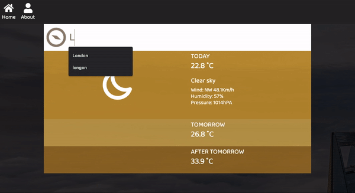
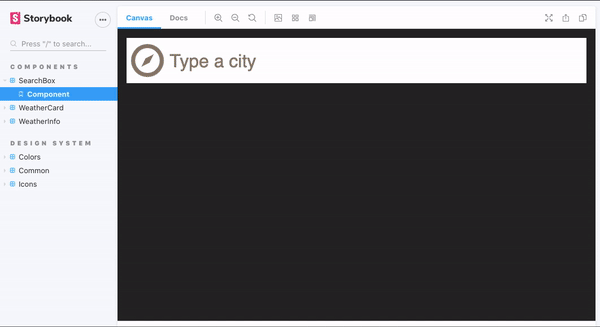
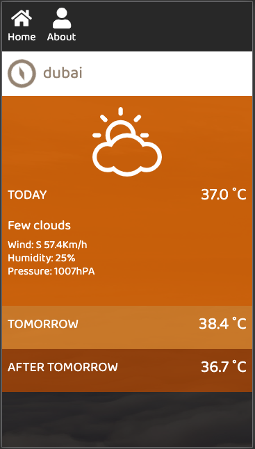
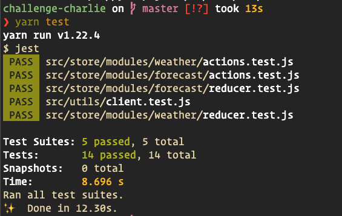

# Weather React

A responsible microsite to show the weather forecast.
This project was developed using the followed technology combination.

- _Frontend:_ React + Styled Components (css-in-js).
- _State Management:_ Redux + Redux Saga + React Hooks.
- _Documentation:_ Storybook
- _Tests:_ Jest (unit-test) + Cypress (e2e)
- _Bundle:_ Webpack
- _Development environment:_ Docker + Docker-Compose
- _Code:_ JavaScript + Eslint + Prettier
- _Git:_ semantic commit messages

## How to start

```shell
git clone $repository
cd $repository
# with docker
docker-compose up --build
# without docker
yarn dev # stats the application port: 3000
yarn storybook # starts storybook port: 6006
yarn test # runs unit tests (jest)
yarn test:e2e # runs end-to-end tests (cypress)
```

## Tecnologias

- [react](https://pt-br.reactjs.org/)
- [hooks](https://pt-br.reactjs.org/docs/hooks-intro.html)
- [redux](https://redux.js.org/)
- [redux-saga](https://redux-saga.js.org/)
- [react-router-dom](https://reactrouter.com/web/guides/quick-start)
- [react-icons](http://react-icons.github.io/react-icons)
- [jest](https://jestjs.io/)
- [storybook](https://storybook.js.org/)
- [styled-components](https://styled-components.com/)
- [prettier](https://prettier.io/)
- [eslint](https://eslint.org/)
- [webpack](https://webpack.js.org/)
- [babel](https://babeljs.io/)
- [axios](https://github.com/axios/axios)
- [polished](https://polished.js.org/)
- [dotenv](https://www.npmjs.com/package/dotenv)
- [docker](https://www.docker.com/)
- [docker-compose](https://docs.docker.com/compose/)

## APIs

- [API do Bing](https://www.bing.com/HPImageArchive.aspx?format=js&idx=0&n=1&mkt=pt-BR)
- [OpenWeather](http://api.openweathermap.org/data/2.5/weather?q={{location_name}}&APPID=7ba73e0eb8efe773ed08bfd0627f07b8)
- [OpenCage](https://api.opencagedata.com/geocode/v1/json?q={{latitude}},{{longitude}}&key=c63386b4f77e46de817bdf94f552cddf&language=en)

## Screens

### Storybook



### Cypress


### App Mobile version



### Jest


